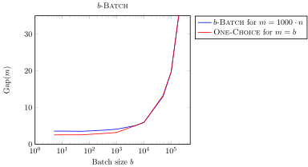
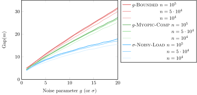
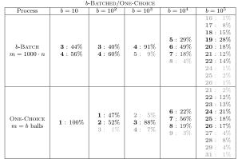
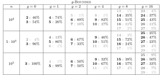
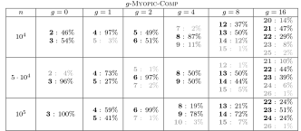
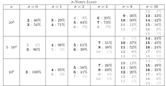

# Code for the  paper "Balanced Allocations with the Choice of Noise"

This repository contains the relatively simple C++ code for reproducing the experiments for the ${b\text{-}{\rm B{\small ATCHED}}}$ setting studied in the paper "Balanced Allocations with the Choice of Noise" which appeared in the PODC 2022 conference ([arxiv version](https://arxiv.org/abs/2206.07503), [slides](https://www.cl.cam.ac.uk/~dl516/slides/podc22_slides.pdf), [visualisations](https://dimitrioslos.com/podc22)).

The code produces the data points for the following two figures and two tables (see ``figs/raw.out`` for raw outputs):

* Average gap for the \BBatch process with $b \in \{ 5, 10, 5 \cdot 10, 10^2, \ldots 10^5, 5 \cdot 10^5 \}$, for $n = 10^4$ and $m = 1000 \cdot n$ and for ${\rm O{\small NE}}\text{-}{\rm C{\small HOICE}}$ for $b$ balls, over $100$ runs.

<p align="center">

</p>

* Average gap for the $g\text{-}{\rm B{\small OUNDED}}$ and $g\text{-}{\rm M{\small YOPIC}}\text{-}{\rm C{\small OMP}}$ with $g \in \{1, \ldots, 20\}$ and $\sigma\text{-}{\rm N{\small OISY}}\text{-}{\rm L{\small OAD}}$ with $\sigma \in \{1, \ldots, 20 \}$, for $n \in \{10^4, 5 \cdot 10^4, 10^5 \}$ and $m = 1000 \cdot n$, over $100$ runs.

<p align="center">

</p>

* Empirical gap distribution for $b\text{-}{\rm B{\small ATCHED}}$ with $b \in \{ 5, 10, 5 \cdot 10, 10^2, \ldots 10^5, 5 \cdot 10^5 \}$, for $n = 10^4$ and $m=1000 \cdot n$ and for ${\rm T{\small WO}\text{-}C{\small HOICE}}$ with $m = b$, over $100$ runs.

<p align="center">

</p>

* Empirical gap distribution for $g\text{-}{\rm B{\small OUNDED}}$ with  $g \in \{ 0, 1, 2, 4, 8, 16 \}$, for $n \in \{ 10^4, 5 \cdot 10^4, 10^5\}$ and $m = 1000 \cdot n$, over $100$ runs.

<p align="center">

</p>

* Empirical gap distribution for $g\text{-}{\rm M{\small YOPIC}}$ with  $g \in \{ 0, 1, 2, 4, 8, 16 \}$, for $n \in \{ 10^4, 5 \cdot 10^4, 10^5\}$ and $m = 1000 \cdot n$, over $100$ runs.

<p align="center">

</p>

* Empirical gap distribution for $\sigma\text{-}{\rm N{\small OISY}\text{-}{\rm L{\small OAD}}}$ with  $\sigma \in \{ 0, 1, 2, 4, 8, 16 \}$, for $n \in \{ 10^4, 5 \cdot 10^4, 10^5\}$ and $m = 1000 \cdot n$, over $100$ runs.

<p align="center">

</p>


## Build instructions

The entire code is two C++ files (using the C++17 standard), so they can be run by running the following commands
```
g++ src/batched_podc_22.cc && ./a.out
g++ src/noise_podc_22.cc && ./a.out
```
(or any other compiler). 

In the `/src` directory there is also a `CMakeLists.txt` file if you want to use `cmake`.

## Contact us

If you are having any trouble running the code or have any other inquiry, don't hesitate to contact us! You can either open an issue or send us an email (see [paper](https://arxiv.org/abs/2206.07503) for email addresses).
